<a href="https://manimarami.com/">
  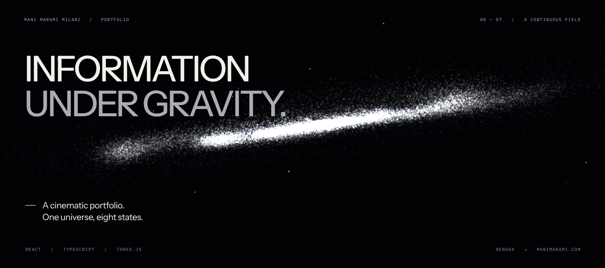
</a>

<p align="center">
  <a href="https://manimarami.com/">Website ↗</a> &nbsp; · &nbsp;
  <a href="#the-experience">The experience</a> &nbsp; · &nbsp;
  <a href="#under-the-surface">How it works</a> &nbsp; · &nbsp;
  <a href="#run-locally">Run locally</a>
</p>

> A personal portfolio told through gravity, particles, and a continuous journey through space.

I'm **Mani Marami Milani**, a Computer Science and Mathematics student at the
University of Lethbridge. This is my portfolio: scientific-data work, software
infrastructure, automation, and algorithms expressed as one changing spatial field.

The same particles move from a galaxy into career orbits, data streams, graph
paths, intersecting systems, and a final horizon. The typography travels with
the scene. The canvas stays alive underneath it.

## The experience

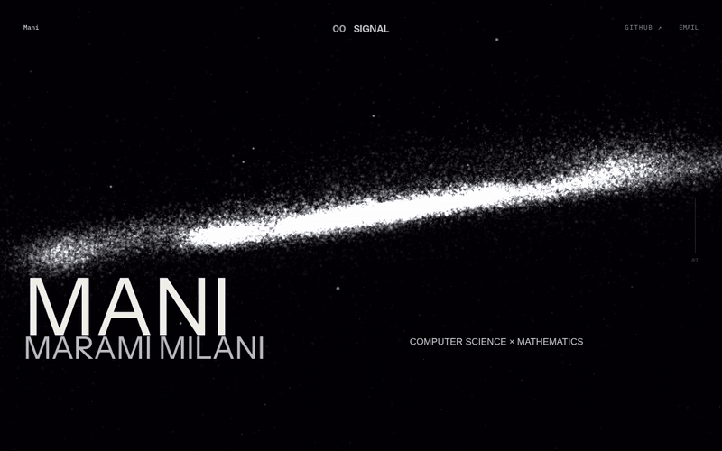

<p align="center"><sub>Signal → Identity · actual WebGL capture · <a href="showcase/assets/gravity-motion.mp4">higher-quality MP4</a></sub></p>

### Eight states. One universe.

| 00 / Signal | 02 / Orbital history |
| --- | --- |
| 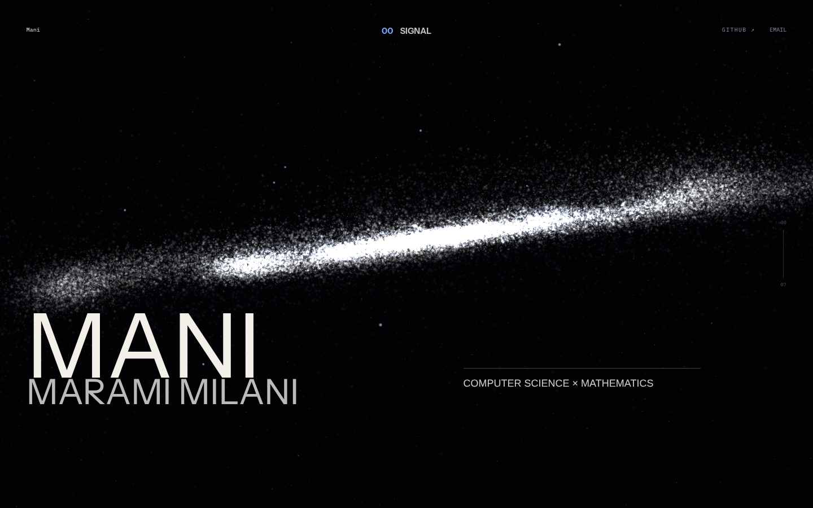 | 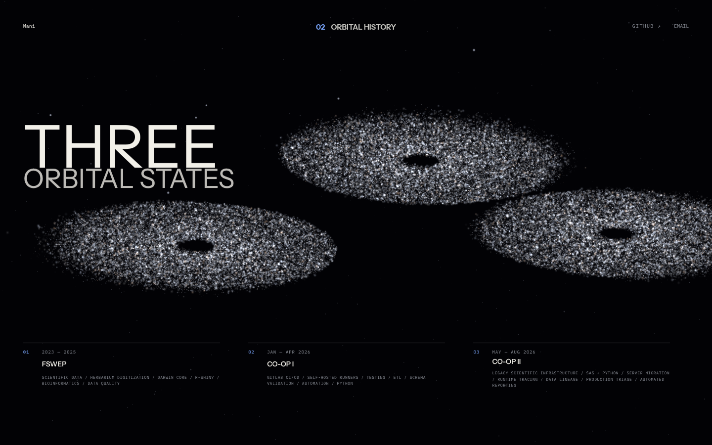 |
| **04 / Algorithm field** | **07 / Horizon** |
| 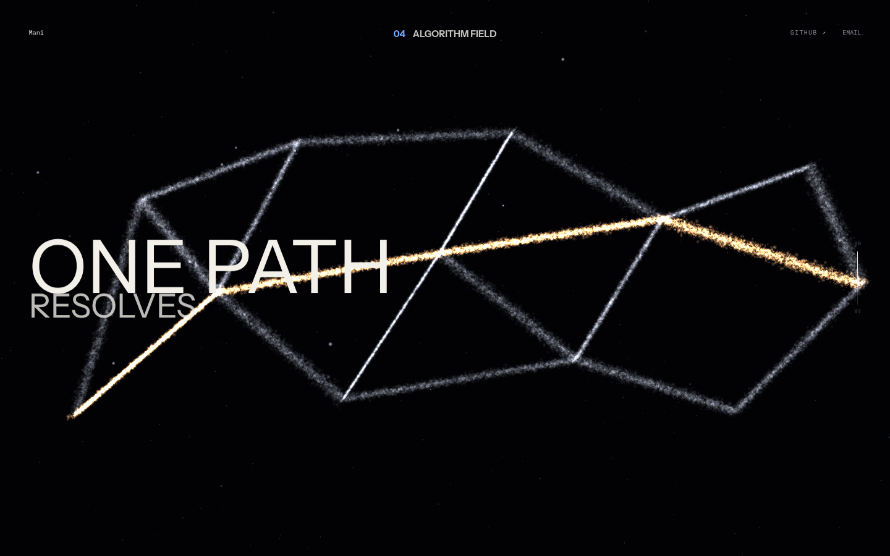 | 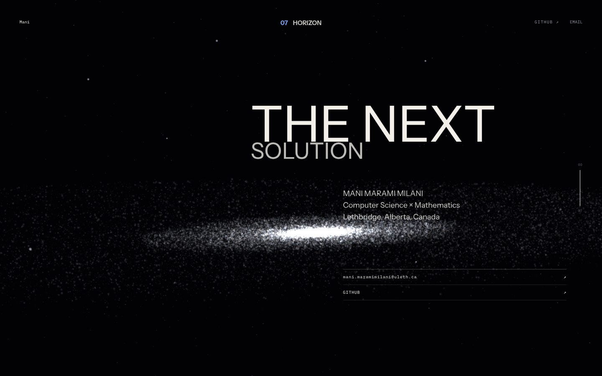 |

The journey follows eight chapters: **Signal**, **Identity**, **Orbital History**,
**Infrastructure**, **Algorithm Field**, **Dual System**, **Human Signal**, and
**Horizon**. Ordinary scrolling moves between them; the chapter index lets you
jump directly to a state.

### From infrastructure to an algorithm

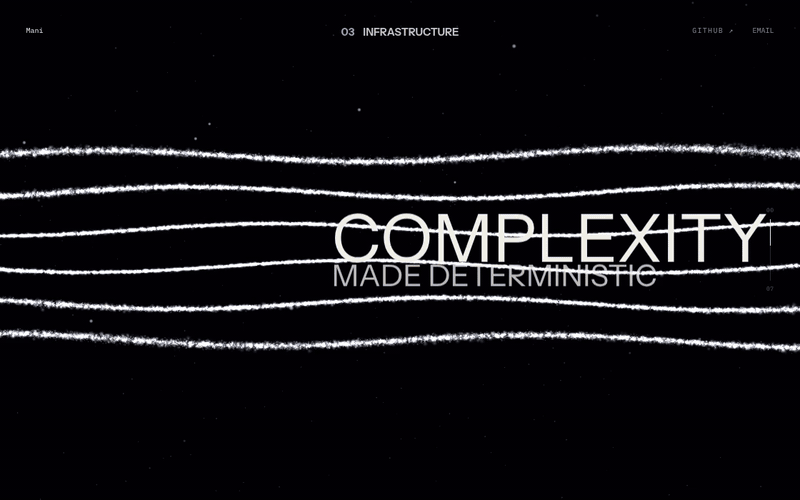

<p align="center"><sub>Infrastructure → Algorithm Field · actual WebGL capture · <a href="showcase/assets/field-motion.mp4">higher-quality MP4</a></sub></p>

<details>
<summary><strong>More frames, including portrait</strong></summary>

<br>

| 01 / Identity | 05 / Dual system |
| --- | --- |
| 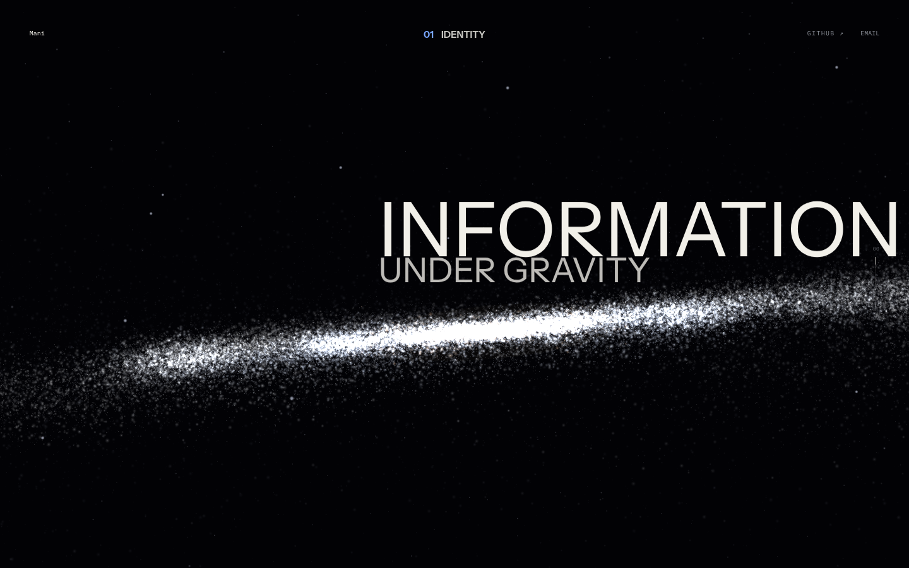 | 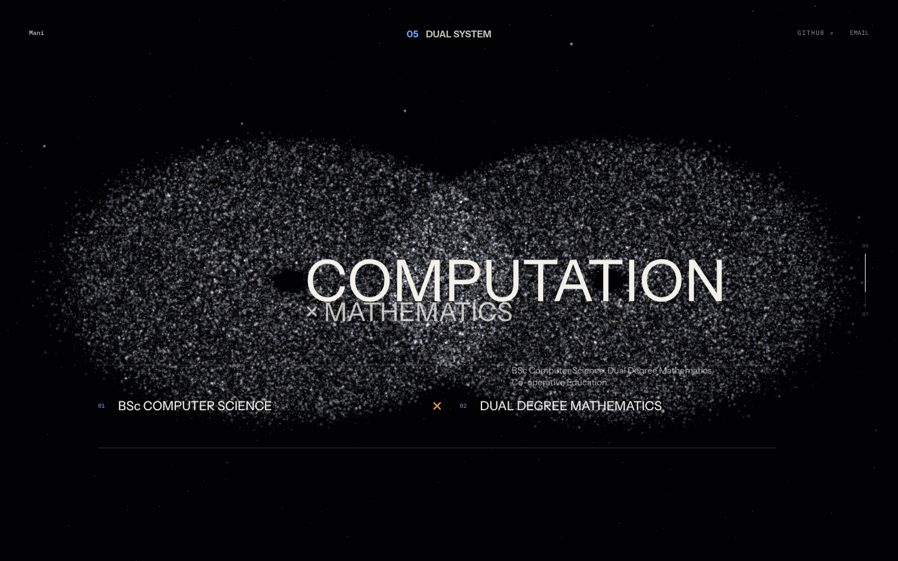 |

<p align="center">
  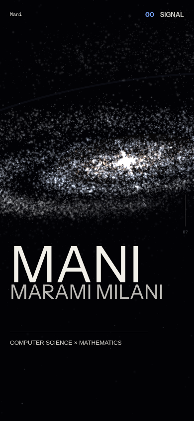
  &nbsp;&nbsp;
  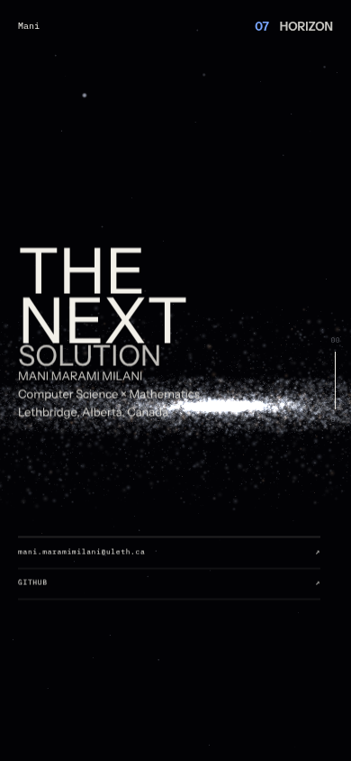
</p>

These are browser viewport captures, not device mockups. The full capture set
and verification notes live in [showcase/](showcase/README.md).

</details>

## Under the surface

**React 19 · TypeScript · Three.js · React Three Fiber · GLSL · Vite**

### A field that changes shape

[`createGalaxy.ts`](src/experience/galaxy/createGalaxy.ts) builds a seeded particle
population with separate target positions for the narrative states. The vertex
shader blends those targets as scroll progress changes. Stars, dust, concentrated
cores, orbital structures, and graph paths share a visual language without
requiring a separate scene mount for every chapter.

Quality profiles select **34,000–150,000 main particles**, plus a separate star
population. Those are configured budgets, not a claim about frame rates on every device.

### Camera and typography follow the same clock

[`useNarrativeScroll.ts`](src/hooks/useNarrativeScroll.ts) maps native scroll to
a continuous eight-state narrative. Camera positions, look targets, group poses,
and DOM visibility follow that shared progress. Camera orientation uses quaternion
interpolation; portrait viewports have their own camera and target poses.

High-frequency motion runs through uniforms, buffers, refs, and animation frames.
React handles the interface, chapter selection, and readiness—not per-particle state updates.

### WebGL rendering, optional WebGPU computation

The visible scene renders through React Three Fiber's **WebGL renderer**.
When a WebGPU adapter is available, a separate WGSL compute pass prewarms up to
32,768 career-orbit positions, then reads the results back into the geometry.
That is an optional initialization enhancement, **not** a continuously running
WebGPU renderer. The portfolio keeps its WebGL path when that enhancement is unavailable.

### Minimal interface, real controls

| Input | Result |
| --- | --- |
| Scroll | Travel through the eight narrative states |
| Chapter label at the top | Open the chapter index |
| Choose a chapter | Move directly to that part of the experience |
| Move the pointer | Apply a restrained influence to the field |
| Mani, top-left | Return to the opening |
| Email | Copy the address, with a mail fallback if clipboard access fails |
| GitHub | Open [Denoax](https://github.com/Denoax) |

Reduced-motion preferences lower the particle budget and soften motion. They do
not disable the renderer completely. Current browser checks and known limitations
are documented with the [showcase notes](showcase/README.md#verification).

## Run locally

Use Node.js 24, matching the included Docker build image.

```sh
git clone https://github.com/Denoax/portfolio.git
cd portfolio
npm ci
npm run dev
```

For a production build and local preview:

```sh
npm run build
npm run preview
```

Vite prints the local address. Build output goes to `dist/`.

### Docker

```sh
docker compose up -d --build
```

The included multi-stage image builds with Node and serves the result with
Caddy. Its HTTP origin is bound to `127.0.0.1:18088` by default. See
[DEPLOYMENT.md](DEPLOYMENT.md) for the existing deployment configuration;
this showcase does not change DNS, TLS, or public hosting.

## Project map

```text
src/
├── app/                  chapter layers, index, identity and contact
├── content/              portfolio facts and eight chapter definitions
├── core/                 narrative state and quality selection
├── hooks/                scroll-to-scene coordination
├── experience/
│   ├── galaxy/           seeded geometry, GLSL materials and camera poses
│   └── webgpu/           optional WGSL career-orbit prewarm
└── styles/               typography, layout and responsive presentation
showcase/                 real captures, banner source and media tooling
AGENTS.md                 galaxy art-direction constitution
```

## Presentation and credits

The screenshots and two looping GIFs were captured from this repository's
production build. The banner combines its real WebGL galaxy with a repository-only
typographic cover. No generated galaxy picture stands in for the running site.
See [how to recreate the media](showcase/README.md#recreate-the-media).

The art-direction constitution references
[Galaxy Interactive](https://interactive.galaxy.com/) for restraint and spatial
storytelling. The bundled `attractors-main/` directory is technical study material
associated with [Scenes3D/attractors](https://github.com/Scenes3D/attractors), not
the production entry point. No blanket reuse permission is implied for that material.
Instrument Sans and IBM Plex Mono are bundled through Fontsource packages with
their respective font licenses. This repository currently has **no project-wide
license**; public visibility alone does not grant unrestricted reuse.

---

**More from the same desk:** [Pelagic — the jellyfish ocean](https://github.com/Denoax/pelagic-jellyfish-webgl)
· [Konata — the Hyprland desktop](https://github.com/Denoax/konata-hyprland-dotfiles)
